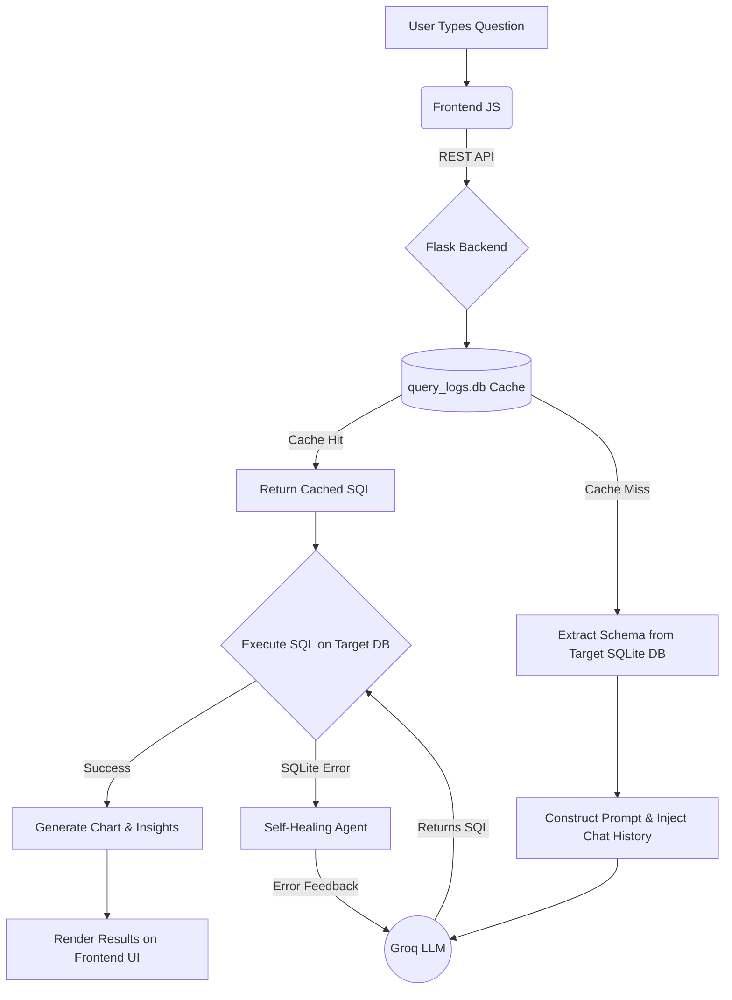

# FluentDB: The AI-Powered Natural Language Database Agent

A production-grade, agentic AI platform that allows users to query databases using natural language. Built with a Flask (Python) backend and a vanilla JavaScript frontend, this platform leverages LLMs to instantly translate conversational English into complex SQL queries, execute them securely, and visualize the results.

## Key Features
* **Conversational AI Querying:** Translates natural language into accurate SQL queries.
* **Intelligent Caching & Interception:** Bypasses LLM API calls for identical past queries and basic introspection queries (like "show db"), reducing cost and latency to zero.
* **Auto-Healing & Cross-DB Suggestions:** If a generated query fails execution (e.g., invalid column name), the agent rewrites the query. If a table is entirely missing, it intelligently scans other uploaded databases and suggests the correct one.
* **Contextual Memory:** Remembers the past 5 interactions to handle conversational follow-up questions seamlessly.
* **Data Visualization & Insights:** Automatically generates Chart.js bar charts for aggregate data and uses the LLM to output an executive summary of the queried dataset.
* **Performance-Optimized Rendering:** Employs infinite scrolling for massive datasets and limits chart data points to prevent browser freezing.
* **Advanced Metrics Dashboard:** Real-time tracking of AI inference latency, database execution latency, token usage, query complexity, and API cost-savings.
* **Secure Database Management:** Drag-and-drop local `.db` SQLite files directly into the UI with a 200MB production-ready upload limit and real-time upload progress tracking.
* **Flexible API Key Management:** Bring your own Groq API key directly via the UI (stored locally in the browser) or via a backend `.env` file.
* **Glassmorphism UI:** State-of-the-art modern dashboard interface featuring a collapsible animated icon sidebar and smooth custom HTML modals.

## Tech Stack
* **Frontend:** HTML5, CSS3 (Glassmorphism), Vanilla JavaScript, Chart.js
* **Backend:** Python, Flask, Werkzeug, SQLite3
* **AI Integration:** Groq API (or any OpenAI-compatible provider)

## Setup & Installation

### 1. Backend Setup
1. Navigate to the `backend` directory: `cd backend`
2. Create a virtual environment: `python -m venv venv`
3. Activate the virtual environment:
   - Mac/Linux: `source venv/bin/activate`
   - Windows: `venv\Scripts\activate`
4. Install dependencies: `pip install -r requirements.txt`
5. Copy the example environment file and add your API key:
   - `cp .env.example .env`
   - Edit `.env` and set `GROQ_API_KEY=your_key_here` (Optional if inputting via UI).
6. Start the server: `python run.py` (Runs on port 5002)

### 2. Frontend Setup
1. Open a new terminal in the `frontend` directory.
2. Serve the static files using Python's built-in server:
   - `python3 -m http.server 8080`
3. Open your browser and navigate to `http://localhost:8080`

## Architecture

The platform operates on a decoupled Client-Server architecture utilizing a RESTful API.

### System Workflow

1. **User Input:** The user submits a natural language question via the Vanilla JS frontend.
2. **Schema Extraction:** The Flask backend interrogates the selected SQLite database using `PRAGMA` commands to extract the live schema (tables, columns, types).
3. **Intelligent Caching:** The logger service checks `query_logs.db` for an exact match. If found, it instantly returns the cached SQL.
4. **AI Generation:** If no cache exists, the schema and the user's conversational history are injected into a highly engineered system prompt and sent to the LLM (Groq).
5. **Auto-Healing Execution:** The LLM returns raw SQL. The backend attempts execution. If SQLite throws an error, the backend autonomously feeds the error back to the LLM for correction.
6. **Data Presentation:** The frontend receives the payload, safely renders the data table, generates an automatic Chart.js visualization, and updates the metrics dashboard.

### Component Breakdown
* **`backend/app/routes/` (Controllers):** Handles HTTP requests (`upload.py` for DB management, `query.py` for LLM generation/execution).
* **`backend/app/services/` (Services):** 
  * `ai.py`: Manages the system prompts, conversational memory buffer, and LLM API calls.
  * `database.py`: Handles secure SQL execution and dynamic schema extraction.
  * `logger.py`: Manages the SQLite caching layer and cost/latency tracking.
* **`frontend/` (Presentation):** A zero-dependency, lightweight client architecture using standard DOM manipulation for maximum execution speed.
